# 📊 Diagrammes du Système de Classes

## 🏗️ Architecture générale du système de classes avec Univers

```mermaid
graph TB
    subgraph "🎯 Couche Application"
        UI[Interface Utilisateur<br/>manage_worlds.php]
        DEMO[Démonstration<br/>demo_classes.php]
        TEST[Tests<br/>test_monde_class.php]
    end
    
    subgraph "🌌 Couche Univers (Unique)"
        UNIVERS[Classe Univers<br/>- Instance unique (Singleton)<br/>- Gestion PDO centralisée<br/>- Cache et statistiques<br/>- Invisible aux utilisateurs]
    end
    
    subgraph "🏛️ Couche Classes Métier"
        MONDE[Classe Monde<br/>- Gestion des mondes<br/>- Validation<br/>- Persistance]
        PAYS[Classe Pays<br/>- Gestion des pays<br/>- Relations avec monde<br/>- Validation]
        DB_CLASS[Classe Database<br/>- Connexions PDO<br/>- Pattern Singleton<br/>- Requêtes SQL]
        AUTO[Autoloader<br/>- Chargement automatique<br/>- Gestion des namespaces]
    end
    
    subgraph "🔧 Couche Infrastructure"
        INIT[init.php<br/>- Initialisation Univers<br/>- Configuration]
        CONFIG[config/database.php<br/>- Paramètres DB<br/>- Connexion]
    end
    
    subgraph "🗄️ Couche Données"
        MYSQL[(MySQL Database)]
        WORLDS[Table: worlds<br/>- id, name, description<br/>- map_url, created_by]
        COUNTRIES[Table: countries<br/>- world_id, name<br/>- description, map_url]
        REGIONS[Table: regions<br/>- country_id, name<br/>- description]
        PLACES[Table: places<br/>- region_id, campaign_id<br/>- name, description]
    end
    
    subgraph "📁 Structure des fichiers"
        CLASSES_DIR[classes/<br/>- Univers.php<br/>- Monde.php<br/>- Pays.php<br/>- Database.php<br/>- Autoloader.php<br/>- init.php]
        INCLUDES_DIR[includes/<br/>- functions.php<br/>- navbar.php]
        CONFIG_DIR[config/<br/>- database.php<br/>- database.test.php]
    end
    
    %% Connexions principales
    UI --> MONDE
    UI --> PAYS
    DEMO --> MONDE
    DEMO --> PAYS
    TEST --> MONDE
    TEST --> PAYS
    
    %% Univers central
    UNIVERS --> MONDE
    UNIVERS --> PAYS
    UNIVERS --> DB_CLASS
    UNIVERS --> MYSQL
    
    MONDE --> PAYS
    PAYS --> MONDE
    
    AUTO --> UNIVERS
    AUTO --> MONDE
    AUTO --> PAYS
    AUTO --> DB_CLASS
    
    INIT --> AUTO
    INIT --> UNIVERS
    
    CONFIG --> UNIVERS
    
    %% Connexions base de données
    MONDE --> WORLDS
    WORLDS --> COUNTRIES
    COUNTRIES --> REGIONS
    REGIONS --> PLACES
    
    %% Structure des fichiers
    CLASSES_DIR --> UNIVERS
    CLASSES_DIR --> MONDE
    CLASSES_DIR --> PAYS
    CLASSES_DIR --> DB_CLASS
    CLASSES_DIR --> AUTO
    CLASSES_DIR --> INIT
    
    INCLUDES_DIR --> UI
    CONFIG_DIR --> CONFIG
    
    %% Styles
    classDef appLayer fill:#e1f5fe,stroke:#01579b,stroke-width:2px
    classDef universLayer fill:#ffebee,stroke:#c62828,stroke-width:3px
    classDef classLayer fill:#f3e5f5,stroke:#4a148c,stroke-width:2px
    classDef infraLayer fill:#e8f5e8,stroke:#1b5e20,stroke-width:2px
    classDef dataLayer fill:#fff3e0,stroke:#e65100,stroke-width:2px
    classDef fileLayer fill:#fce4ec,stroke:#880e4f,stroke-width:2px
    
    class UI,DEMO,TEST appLayer
    class UNIVERS universLayer
    class MONDE,PAYS,DB_CLASS,AUTO classLayer
    class INIT,CONFIG infraLayer
    class MYSQL,WORLDS,COUNTRIES,REGIONS,PLACES dataLayer
    class CLASSES_DIR,INCLUDES_DIR,CONFIG_DIR fileLayer
```

## 🏛️ Architecture en couches détaillée

```mermaid
graph TB
    subgraph "🎨 Couche Présentation"
        WEB[Pages Web<br/>manage_worlds.php<br/>demo_classes.php<br/>test_monde_class.php]
        FORMS[Formulaires HTML<br/>- Création monde<br/>- Édition monde<br/>- Suppression monde]
        UI_COMP[Composants UI<br/>- Modals Bootstrap<br/>- Messages d'erreur<br/>- Aperçu images]
    end
    
    subgraph "🎯 Couche Logique Métier"
        MONDE_LOGIC[Classe Monde<br/>- Encapsulation données<br/>- Validation métier<br/>- Règles de gestion]
        VALIDATION[Validation<br/>- Vérification nom<br/>- Contrôle taille<br/>- Format données]
        BUSINESS_RULES[Règles métier<br/>- Unicité nom<br/>- Propriété utilisateur<br/>- Contraintes suppression]
    end
    
    subgraph "🔧 Couche Accès aux Données"
        DB_LAYER[Classe Database<br/>- Pattern Singleton<br/>- Gestion connexions<br/>- Pool de connexions]
        QUERY_BUILDER[Requêtes SQL<br/>- SELECT optimisées<br/>- INSERT sécurisées<br/>- UPDATE contrôlées]
        TRANSACTION[Gestion Transactions<br/>- ACID properties<br/>- Rollback automatique<br/>- Isolation niveaux]
    end
    
    subgraph "🗄️ Couche Persistance"
        MYSQL_DB[(MySQL Database<br/>InnoDB Engine)]
        TABLES[Tables<br/>- worlds<br/>- countries<br/>- regions<br/>- places]
        INDEXES[Indexes<br/>- Performance<br/>- Contraintes<br/>- Clés étrangères]
    end
    
    subgraph "⚙️ Couche Infrastructure"
        AUTOLOAD[Autoloader<br/>- PSR-4 compatible<br/>- Chargement lazy<br/>- Cache classes]
        CONFIG_MGR[Gestion Config<br/>- Environnements<br/>- Variables d'env<br/>- Sécurité]
        ERROR_HANDLER[Gestion Erreurs<br/>- Logging centralisé<br/>- Exceptions typées<br/>- Debug mode]
    end
    
    %% Flux de données
    WEB --> FORMS
    FORMS --> UI_COMP
    UI_COMP --> MONDE_LOGIC
    
    MONDE_LOGIC --> VALIDATION
    VALIDATION --> BUSINESS_RULES
    BUSINESS_RULES --> DB_LAYER
    
    DB_LAYER --> QUERY_BUILDER
    QUERY_BUILDER --> TRANSACTION
    TRANSACTION --> MYSQL_DB
    
    MYSQL_DB --> TABLES
    TABLES --> INDEXES
    
    %% Infrastructure
    AUTOLOAD --> MONDE_LOGIC
    AUTOLOAD --> DB_LAYER
    CONFIG_MGR --> DB_LAYER
    ERROR_HANDLER --> MONDE_LOGIC
    ERROR_HANDLER --> DB_LAYER
    
    %% Styles avec couleurs distinctes
    classDef presentation fill:#e3f2fd,stroke:#0277bd,stroke-width:3px,color:#000
    classDef business fill:#f1f8e9,stroke:#388e3c,stroke-width:3px,color:#000
    classDef data fill:#fff8e1,stroke:#f57c00,stroke-width:3px,color:#000
    classDef persistence fill:#fce4ec,stroke:#c2185b,stroke-width:3px,color:#000
    classDef infrastructure fill:#f3e5f5,stroke:#7b1fa2,stroke-width:3px,color:#000
    
    class WEB,FORMS,UI_COMP presentation
    class MONDE_LOGIC,VALIDATION,BUSINESS_RULES business
    class DB_LAYER,QUERY_BUILDER,TRANSACTION data
    class MYSQL_DB,TABLES,INDEXES persistence
    class AUTOLOAD,CONFIG_MGR,ERROR_HANDLER infrastructure
```



## 🔄 Flux de données et interactions

```mermaid
sequenceDiagram
    participant U as Utilisateur
    participant W as Web Interface
    participant M as Classe Monde
    participant V as Validation
    participant D as Database
    participant DB as MySQL
    
    Note over U,DB: Création d'un nouveau monde
    
    U->>W: Remplit formulaire
    W->>M: new Monde(getPDO())
    M->>M: setData(formData)
    M->>V: validate()
    
    alt Données valides
        V-->>M: ✅ Validation OK
        M->>D: getInstance()
        D-->>M: PDO instance
        M->>DB: INSERT INTO worlds
        DB-->>M: ID généré
        M-->>W: Succès + ID
        W-->>U: Message confirmation
    else Données invalides
        V-->>M: ❌ Erreurs validation
        M-->>W: Liste erreurs
        W-->>U: Affichage erreurs
    end
    
    Note over U,DB: Récupération des mondes
    
    U->>W: Demande liste mondes
    W->>M: Monde::findByUser(user_id)
    M->>D: selectAll(SQL, params)
    D->>DB: SELECT FROM worlds
    DB-->>D: Résultats
    D-->>M: Array mondes
    M-->>W: Collection Monde[]
    W-->>U: Affichage liste
```



## 🌌 Diagramme de la classe Univers


## 🎯 Diagramme de classes Monde et Pays

```mermaid
classDiagram
    class Monde {
        -int id
        -string name
        -string description
        -string map_url
        -int created_by
        -datetime created_at
        -datetime updated_at
        -PDO pdo
        
        +__construct(PDO pdo, array data)
        +getId() int
        +getName() string
        +getDescription() string
        +getMapUrl() string
        +getCreatedBy() int
        +getCreatedAt() datetime
        +getUpdatedAt() datetime
        +setName(string name) Monde
        +setDescription(string description) Monde
        +setMapUrl(string map_url) Monde
        +setCreatedBy(int created_by) Monde
        +validate() array
        +save() bool
        +delete() bool
        +getCountryCount() int
        +getCountries() array
        +toArray() array
        +__toString() string
        +findById(PDO pdo, int id) Monde
        +findByUser(PDO pdo, int user_id) array
        +nameExists(PDO pdo, string name, int user_id) bool
    }
    
    class Pays {
        -int id
        -int world_id
        -string name
        -string description
        -string map_url
        -string coat_of_arms_url
        -datetime created_at
        -datetime updated_at
        -PDO pdo
        
        +__construct(PDO pdo, array data)
        +getId() int
        +getWorldId() int
        +getName() string
        +getDescription() string
        +getMapUrl() string
        +getCoatOfArmsUrl() string
        +getCreatedAt() datetime
        +getUpdatedAt() datetime
        +setWorldId(int world_id) Pays
        +setName(string name) Pays
        +setDescription(string description) Pays
        +setMapUrl(string map_url) Pays
        +setCoatOfArmsUrl(string coat_of_arms_url) Pays
        +validate() array
        +save() bool
        +delete() bool
        +getMonde() Monde
        +getRegionCount() int
        +getRegions() array
        +getWorldName() string
        +toArray() array
        +__toString() string
        +findById(PDO pdo, int id) Pays
        +findByWorld(PDO pdo, int world_id) array
        +findByUser(PDO pdo, int user_id) array
        +nameExistsInWorld(PDO pdo, string name, int world_id) bool
    }
    
    class Database {
        -static Database instance
        -PDO pdo
        -string host
        -string dbname
        -string username
        -string password
        -string charset
        
        -__construct(array config)
        +getInstance(array config) Database
        +getPdo() PDO
        +selectAll(string sql, array params) array
        +selectOne(string sql, array params) array
        +execute(string sql, array params) int
        +insert(string sql, array params) int
        +beginTransaction() bool
        +commit() bool
        +rollback() bool
        +inTransaction() bool
        +quote(string string) string
        +prepare(string sql) PDOStatement
        +close()
    }
    
    class Autoloader {
        -static array directories
        -static bool registered
        
        +register(array directories)
        +load(string className)
        +addDirectory(string directory)
        +removeDirectory(string directory)
        +getDirectories() array
        +isClassLoaded(string className) bool
        +getLoadedClasses() array
    }
    
    %% Relations
    Database --> Monde : provides PDO
    Database --> Pays : provides PDO
    Autoloader --> Monde : loads class
    Autoloader --> Pays : loads class
    Autoloader --> Database : loads class
    Monde ||--o{ Pays : contains
    Pays }o--|| Monde : belongs to
```

## 🔄 Flux de création d'un monde


## 🏰 Flux de création d'un pays

```mermaid
sequenceDiagram
    participant U as Utilisateur
    participant F as Formulaire
    participant P as Classe Pays
    participant M as Classe Monde
    participant D as Database
    participant DB as Base de données
    
    Note over U,DB: Création d'un nouveau pays
    
    U->>F: Remplit le formulaire pays
    F->>P: new Pays(getPDO())
    P->>P: setWorldId(world_id)
    P->>P: setName(name)
    P->>P: setDescription(description)
    P->>P: setMapUrl(map_url)
    P->>P: setCoatOfArmsUrl(coat_url)
    P->>P: validate()
    
    alt Validation réussie
        P->>D: getPdo()
        D-->>P: PDO instance
        P->>DB: INSERT INTO countries
        DB-->>P: ID du pays créé
        P-->>F: Succès
        F-->>U: Message de confirmation
    else Validation échouée
        P-->>F: Erreurs de validation
        F-->>U: Affichage des erreurs
    end
    
    Note over U,DB: Récupération des pays d'un monde
    
    U->>F: Demande pays du monde
    F->>P: Pays::findByWorld(world_id)
    P->>D: selectAll(SQL, params)
    D->>DB: SELECT FROM countries WHERE world_id = ?
    DB-->>D: Résultats
    D-->>P: Array pays
    P-->>F: Collection Pays[]
    F-->>U: Affichage liste pays
```



## 🗄️ Structure de la base de données


## 🚀 Flux d'autoloading

```mermaid
flowchart TD
    A[Require classes/init.php] --> B[Autoloader::register()]
    B --> C[spl_autoload_register()]
    C --> D[Classe demandée]
    D --> E[Autoloader::load()]
    E --> F[Convertir nom de classe en fichier]
    F --> G[Rechercher dans les répertoires]
    G --> H{Fichier trouvé?}
    H -->|Oui| I[require_once fichier]
    H -->|Non| J[Erreur: Classe non trouvée]
    I --> K[Classe disponible]
```

## 🚀 Architecture de déploiement

```mermaid
graph TB
    subgraph "🌐 Environnement de Production"
        subgraph "🖥️ Serveur Web"
            APACHE[Apache/Nginx<br/>- Serveur HTTP<br/>- Gestion SSL<br/>- Compression]
            PHP[PHP 8.x<br/>- Interpréteur<br/>- Extensions PDO<br/>- Autoloading]
        end
        
        subgraph "📁 Système de fichiers"
            ROOT[/var/www/html/jdrmj/]
            CLASSES[classes/<br/>- Monde.php<br/>- Database.php<br/>- Autoloader.php]
            INCLUDES[includes/<br/>- functions.php<br/>- navbar.php]
            CONFIG[config/<br/>- database.php<br/>- database.test.php]
            UPLOADS[uploads/<br/>- worlds/<br/>- countries/<br/>- regions/]
        end
        
        subgraph "🗄️ Base de données"
            MYSQL_PROD[(MySQL Production<br/>- InnoDB Engine<br/>- UTF8MB4<br/>- Indexes optimisés)]
            BACKUP[Backup Strategy<br/>- Sauvegardes quotidiennes<br/>- Réplication<br/>- Point-in-time recovery]
        end
        
        subgraph "🔒 Sécurité"
            FIREWALL[Firewall<br/>- Ports 80/443<br/>- Protection DDoS<br/>- Rate limiting]
            SSL[SSL/TLS<br/>- Certificats Let's Encrypt<br/>- HTTPS obligatoire<br/>- HSTS]
        end
    end
    
    subgraph "🛠️ Environnement de Développement"
        DEV_SERVER[Serveur de dev<br/>- XAMPP/WAMP<br/>- PHP 8.x<br/>- MySQL local]
        DEV_DB[(MySQL Dev<br/>- Données de test<br/>- Structure identique<br/>- Données anonymisées)]
        GIT[Git Repository<br/>- Version control<br/>- Branches feature<br/>- CI/CD pipeline]
    end
    
    subgraph "👥 Utilisateurs"
        MJ[Maitres de Jeu<br/>- Création mondes<br/>- Gestion campagnes<br/>- Administration]
        PLAYERS[Joueurs<br/>- Consultation<br/>- Personnages<br/>- Participation]
        ADMIN[Administrateurs<br/>- Maintenance<br/>- Configuration<br/>- Support]
    end
    
    %% Connexions
    MJ --> APACHE
    PLAYERS --> APACHE
    ADMIN --> APACHE
    
    APACHE --> PHP
    PHP --> CLASSES
    PHP --> INCLUDES
    PHP --> CONFIG
    
    PHP --> MYSQL_PROD
    MYSQL_PROD --> BACKUP
    
    APACHE --> SSL
    APACHE --> FIREWALL
    
    DEV_SERVER --> DEV_DB
    DEV_SERVER --> GIT
    GIT --> ROOT
    
    %% Styles
    classDef production fill:#e8f5e8,stroke:#2e7d32,stroke-width:2px
    classDef development fill:#fff3e0,stroke:#ef6c00,stroke-width:2px
    classDef users fill:#e3f2fd,stroke:#1565c0,stroke-width:2px
    classDef security fill:#ffebee,stroke:#c62828,stroke-width:2px
    
    class APACHE,PHP,ROOT,CLASSES,INCLUDES,CONFIG,UPLOADS,MYSQL_PROD,BACKUP production
    class DEV_SERVER,DEV_DB,GIT development
    class MJ,PLAYERS,ADMIN users
    class FIREWALL,SSL security
```



## 📊 Métriques et monitoring

```mermaid
graph LR
    subgraph "📈 Monitoring Application"
        PERF[Performance<br/>- Temps de réponse<br/>- Utilisation CPU<br/>- Mémoire RAM]
        ERRORS[Gestion Erreurs<br/>- Logs centralisés<br/>- Alertes automatiques<br/>- Stack traces]
        USAGE[Usage Analytics<br/>- Utilisateurs actifs<br/>- Fonctionnalités utilisées<br/>- Patterns d'usage]
    end
    
    subgraph "🗄️ Monitoring Base de données"
        QUERY_PERF[Performance Requêtes<br/>- Slow query log<br/>- Index usage<br/>- Query optimization]
        CONNECTIONS[Connexions DB<br/>- Pool de connexions<br/>- Timeouts<br/>- Deadlocks]
        STORAGE[Stockage<br/>- Taille des tables<br/>- Croissance données<br/>- Nettoyage automatique]
    end
    
    subgraph "🔒 Monitoring Sécurité"
        AUTH[Authentification<br/>- Tentatives de connexion<br/>- Sessions actives<br/>- Logout automatique]
        ACCESS[Contrôle d'accès<br/>- Permissions utilisateurs<br/>- Actions sensibles<br/>- Audit trail]
        THREATS[Détection menaces<br/>- Tentatives d'intrusion<br/>- Patterns suspects<br/>- Blocage automatique]
    end
    
    PERF --> ERRORS
    ERRORS --> USAGE
    QUERY_PERF --> CONNECTIONS
    CONNECTIONS --> STORAGE
    AUTH --> ACCESS
    ACCESS --> THREATS
    
    classDef monitoring fill:#f3e5f5,stroke:#7b1fa2,stroke-width:2px
    classDef database fill:#e8f5e8,stroke:#388e3c,stroke-width:2px
    classDef security fill:#ffebee,stroke:#d32f2f,stroke-width:2px
    
    class PERF,ERRORS,USAGE monitoring
    class QUERY_PERF,CONNECTIONS,STORAGE database
    class AUTH,ACCESS,THREATS security
```



## 📈 Évolution future du système

```mermaid
graph LR
    subgraph "Phase 1 - Actuelle"
        A[Monde]
        B[Database]
        C[Autoloader]
    end
    
    subgraph "Phase 2 - Prochaine"
        D[Pays]
        E[Région]
        F[Lieu]
    end
    
    subgraph "Phase 3 - Future"
        G[Campagne]
        H[Personnage]
        I[Monstre]
        J[Objet]
    end
    
    A --> D
    D --> E
    E --> F
    F --> G
    G --> H
    G --> I
    G --> J
```



## 🎨 Comment utiliser ces diagrammes

1. **Copiez le code Mermaid** entre les balises \`\`\`mermaid
2. **Collez-le dans un fichier .md** ou dans les commentaires de votre code
3. **Cursor affichera automatiquement** le diagramme rendu
4. **Utilisez Ctrl+Shift+P** et tapez "Mermaid" pour les commandes

## 📝 Exemples d'utilisation dans le code

```php
/**
 * Classe Monde - Gestion des mondes de campagne
 * 
 * ```mermaid
 * graph TD
 *     A[Monde] --> B[Propriétés]
 *     A --> C[Méthodes]
 *     B --> D[id, name, description]
 *     C --> E[save, delete, validate]
 * ```
 */
class Monde {
    // ... code de la classe
}
```

## 🏞️ Diagramme de classes complet avec Region

```mermaid
classDiagram
    class Univers {
        -static Univers instance
        -PDO pdo
        -array config
        -array cache
        -array stats
        
        -__construct(array config)
        +getInstance(array config) Univers
        -loadDefaultConfig() array
        -initializeDatabase()
        -loadStats()
        
        +getPdo() PDO
        +getConfig() array
        +getStats() array
        +getAppName() string
        +getAppVersion() string
        +getEnvironment() string
        
        +createMonde(string name, string description, int created_by, string map_url) Monde
        +getAllMondes() array
        +getMondeById(int id) Monde
        
        +createPays(int world_id, string name, string description, string map_url, string coat_url) Pays
        +getAllPays() array
        
        +createRegion(int country_id, string name, string description, string map_url, string coat_url) Region
        +getAllRegions() array
        +getRegionById(int id) Region
        
        +cache(string key, mixed value, int ttl) void
        +getCache(string key) mixed
        +clearCache(string key) void
        
        +getHealthStatus() array
        +cleanup() void
        +saveState() array
        +toArray() array
        +__toString() string
    }
    
    class Monde {
        -int id
        -string name
        -string description
        -string map_url
        -int created_by
        -datetime created_at
        -datetime updated_at
        
        +__construct(array data)
        +getId() int
        +getName() string
        +getDescription() string
        +getMapUrl() string
        +getCreatedBy() int
        +getCreatedAt() datetime
        +getUpdatedAt() datetime
        +setName(string name) Monde
        +setDescription(string description) Monde
        +setMapUrl(string map_url) Monde
        +setCreatedBy(int created_by) Monde
        +validate() array
        +save() bool
        +delete() bool
        +getCountryCount() int
        +getCountries() array
        +toArray() array
        +__toString() string
        +findById(int id) Monde
        +findByUser(int user_id) array
        +nameExists(string name, int user_id, int exclude_id) bool
        -getPdo() PDO
    }
    
    class Pays {
        -int id
        -int world_id
        -string name
        -string description
        -string map_url
        -string coat_of_arms_url
        -datetime created_at
        -datetime updated_at
        
        +__construct(array data)
        +getId() int
        +getWorldId() int
        +getName() string
        +getDescription() string
        +getMapUrl() string
        +getCoatOfArmsUrl() string
        +getCreatedAt() datetime
        +getUpdatedAt() datetime
        +setWorldId(int world_id) Pays
        +setName(string name) Pays
        +setDescription(string description) Pays
        +setMapUrl(string map_url) Pays
        +setCoatOfArmsUrl(string coat_of_arms_url) Pays
        +validate() array
        +save() bool
        +delete() bool
        +getMonde() Monde
        +getRegionCount() int
        +getRegions() array
        +getWorldName() string
        +toArray() array
        +__toString() string
        +findById(int id) Pays
        +findByWorld(int world_id) array
        +findByUser(int user_id) array
        +nameExistsInWorld(string name, int world_id, int exclude_id) bool
        -getPdo() PDO
    }
    
    class Region {
        -int id
        -int country_id
        -string name
        -string description
        -string map_url
        -string coat_of_arms_url
        -datetime created_at
        -datetime updated_at
        
        +__construct(array data)
        +getId() int
        +getCountryId() int
        +getName() string
        +getDescription() string
        +getMapUrl() string
        +getCoatOfArmsUrl() string
        +getCreatedAt() datetime
        +getUpdatedAt() datetime
        +setCountryId(int country_id) Region
        +setName(string name) Region
        +setDescription(string description) Region
        +setMapUrl(string map_url) Region
        +setCoatOfArmsUrl(string coat_of_arms_url) Region
        +validate() array
        +save() bool
        +delete() bool
        +getPays() Pays
        +getMonde() Monde
        +getPlaceCount() int
        +getPlaces() array
        +getCountryName() string
        +getWorldName() string
        +toArray() array
        +__toString() string
        +findById(int id) Region
        +findByCountry(int country_id) array
        +findByUser(int user_id) array
        +nameExistsInCountry(string name, int country_id, int exclude_id) bool
        -getPdo() PDO
    }
    
    class Database {
        -static Database instance
        -PDO pdo
        
        -__construct()
        +getInstance() Database
        +getPdo() PDO
        +selectAll(string sql, array params) array
        +selectOne(string sql, array params) array
        +execute(string sql, array params) bool
        +insert(string sql, array params) int
        +beginTransaction() bool
        +commit() bool
        +rollback() bool
        +inTransaction() bool
        +quote(string value) string
        +prepare(string sql) PDOStatement
        +close() void
    }
    
    Univers ||--|| Database : "utilise"
    Univers ||--o{ Monde : "gère"
    Univers ||--o{ Pays : "gère"
    Univers ||--o{ Region : "gère"
    Monde ||--o{ Pays : "contient"
    Pays ||--o{ Region : "contient"
```

## 🌍 Flux de création d'une région

```mermaid
sequenceDiagram
    participant U as Utilisateur
    participant W as Web Interface
    participant R as Region
    participant P as Pays
    participant M as Monde
    participant DB as Base de Données
    
    Note over U,DB: Création d'une nouvelle région
    
    U->>W: Saisit données région
    W->>R: new Region(data)
    R->>R: validate()
    
    alt Données valides
        R->>P: Vérifier existence pays
        P->>DB: SELECT FROM countries
        DB-->>P: Pays trouvé
        P-->>R: ✅ Pays valide
        R->>DB: INSERT INTO regions
        DB-->>R: ID région créée
        R-->>W: ✅ Région créée
        W-->>U: Confirmation création
    else Données invalides
        R-->>W: ❌ Erreurs validation
        W-->>U: Affichage erreurs
    end
    
    Note over U,DB: Récupération des régions
    
    U->>W: Demande liste régions
    W->>R: Region::findByUser(user_id)
    R->>DB: SELECT FROM regions JOIN countries JOIN worlds
    DB-->>R: Résultats
    R-->>W: Collection Region[]
    W-->>U: Affichage liste
```


